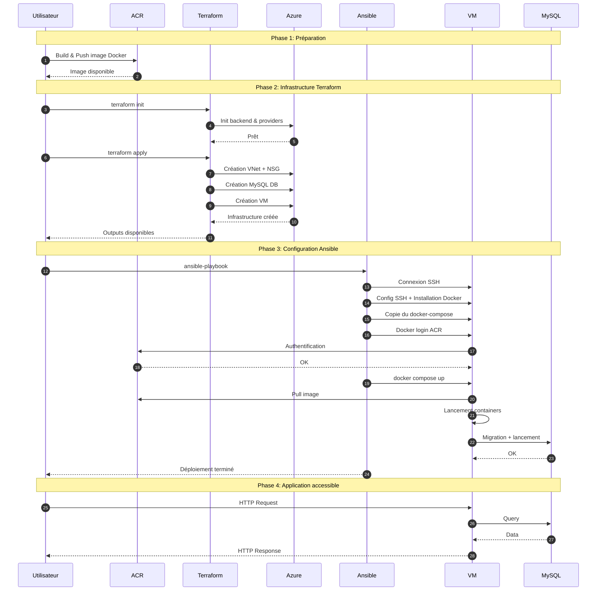

# Schéma de déploiement IaaS

Ce document explique le workflow complet du déploiement IaaS, étape par étape.

## Diagramme de séquence du déploiement

Le diagramme suivant illustre les interactions entre les différents composants lors du déploiement IaaS :



## Détail des étapes

### Étape 1 : Préparation

**Actions effectuées :**
1. Build de l'image Docker depuis `source/sample-app-master/`
2. Push de l'image vers Azure Container Registry (ACR)
3. Configuration des variables Terraform dans `secret.tfvars`
4. Ajout de la clé SSH publique dans `terraform/vm/id_rsa.pub`

**Script utilisé :**
```bash
source/build-docker-image-iaas.sh
```

**Résultat :**
- Image Docker disponible dans ACR : `image-iaas:latest`
- Variables configurées
- Clé SSH prête

### Étape 2 : Terraform Init

**Commande :**
```bash
terraform init -reconfigure
```

**Actions effectuées :**
- Initialise le backend Azure Storage pour stocker l'état Terraform
- Télécharge les providers nécessaires (azurerm)
- Configure les modules locaux

**Résultat :**
- Terraform prêt à appliquer la configuration
- État Terraform synchronisé avec le backend

### Étape 3 : Terraform Apply

**Commande :**
```bash
terraform apply -var-file="secret.tfvars" -auto-approve
```

**Ressources créées (dans l'ordre) :**

1. **Bootstrap** (`terraform/bootstrap/`)
   - Vérification/création du Resource Group
   - Vérification du Storage Account pour le backend

2. **Network** (`terraform/network/`)
   - Création du Virtual Network (VNet)
   - Création du sous-réseau pour la VM
   - Création du Network Security Group (NSG) avec règles pour SSH (22), HTTP (80) et HTTPS (443)
   - Association du NSG au sous-réseau
   - Configuration des adresses IP

3. **Database** (`terraform/db/`)
   - Création de la base de données Azure Database for MySQL
   - Configuration des règles de pare-feu
   - Création de la base de données et de l'utilisateur

4. **Virtual Machine** (`terraform/vm/`)
   - Création de l'adresse IP publique
   - Création de l'interface réseau (NIC)
   - Création de la machine virtuelle Linux (Debian 12)
   - Configuration de la clé SSH publique
   - Association au réseau et sous-réseau

**Note :** Un Network Security Group (NSG) est désormais créé et associé au sous-réseau. La sécurité réseau est gérée par :
- Le Network Security Group (NSG) pour filtrer le trafic vers la VM (ports 22, 80, 443 ouverts).
- Les règles de pare-feu de la base de données Azure (qui autorisent les connexions depuis certaines IP).
- Ansible n'a pas besoin de configurer les iptables car le NSG prend le relais pour la sécurité réseau de la VM.

**Résultat :**
- Infrastructure Azure complète créée
- VM accessible via SSH
- Base de données prête à recevoir des connexions

### Étape 4 : Récupération des Outputs Terraform

**Actions effectuées :**
Le script `start.sh` récupère automatiquement :
- `acr_password` : Mot de passe pour se connecter à ACR
- `db_host` : Adresse FQDN de la base de données
- `db_database` : Nom de la base de données
- `db_username` : Identifiant de connexion à la DB
- `db_password` : Mot de passe de connexion à la DB

**Résultat :**
- Toutes les informations nécessaires pour Ansible sont disponibles

### Étape 5 : Ansible Playbook

**Commande :**
```bash
ansible-playbook playbooks/init_terra_cloud.yml \
  --limit terra_cloud_app \
  --extra-vars "acr_password=..." \
  --extra-vars "db_host=..." \
  --extra-vars "db_database=..." \
  --extra-vars "db_username=..." \
  --extra-vars "db_password=..."
```

**Playbook exécuté :** `ansible/playbooks/init_terra_cloud.yml`

#### Rôle 1 : setup_ssh_key

**Tâches exécutées :**
- Création de l'utilisateur `ansible`
- Configuration des clés SSH autorisées dans `/home/ansible/.ssh/authorized_keys`

#### Rôle 2 : install_docker

**Tâches exécutées :**
- Vérification de l'installation Docker existante
- Nettoyage de l'ancienne installation si présente
- Mise à jour du cache des paquets (`apt update`)
- Installation des dépendances (ca-certificates, curl, lsb-release)
- Téléchargement de la clé GPG Docker
- Configuration du dépôt Docker pour APT
- Installation de Docker Engine, CLI, containerd, buildx et compose-plugin

#### Section : Déploiement des fichiers

**Tâches exécutées :**
- Création du répertoire `/opt/cloud-app`
- Génération du fichier `.env` (si template existe)
- Copie du fichier `docker-compose.yaml`

**Contenu du docker-compose.yaml :**
- **Service Traefik** : Reverse proxy (ports 80 et 8082)
- **Service App** : Application Laravel (image depuis ACR, migrations et seeders au démarrage)

#### Section : Authentification ACR et démarrage

**Tâches exécutées :**
- Authentification à Azure Container Registry (`docker login`)
- Démarrage des conteneurs avec `docker compose up -d`

**Ce qui se passe lors du démarrage :**
- Pull de l'image Docker depuis ACR
- Création du réseau Docker
- Démarrage du conteneur Traefik
- Démarrage du conteneur App (migrations et seeders exécutés)
- Configuration du routage Traefik vers l'application

**Résultat :**
- VM configurée avec Docker installé
- Application Laravel déployée et accessible via HTTP sur l'IP publique
- Base de données connectée et migrations exécutées

**Durée estimée :** 3-5 minutes

**Points critiques :**
- L'authentification ACR doit réussir (vérifier les identifiants)
- L'image Docker doit exister dans ACR avec le bon tag
- La connexion à la base de données doit être possible depuis la VM
- Les règles de pare-feu de la base de données Azure doivent autoriser les connexions depuis l'IP de la VM

### Étape 6 : Application déployée

**Vérifications :**
- Application accessible sur `http://<IP_PUBLIQUE>`
- Base de données connectée
- Conteneurs Docker en cours d'exécution

## Ordre d'exécution détaillé

1. **Terraform Bootstrap** → Crée/vérifie le Resource Group
2. **Terraform Network** → Crée le VNet et sous-réseau
3. **Terraform Database** → Crée la base de données MySQL
4. **Terraform VM** → Crée la machine virtuelle
5. **Terraform Outputs** → Récupère les informations nécessaires
6. **Ansible SSH Setup** → Configure l'accès SSH
7. **Ansible Docker Install** → Installe Docker sur la VM
8. **Ansible Firewall Setup** → Configure iptables
9. **Ansible App Deploy** → Démarre l'application

## Points d'attention

1. **Clé SSH** : Doit être configurée avant le déploiement
2. **Image Docker** : Doit être poussée dans ACR avant le déploiement
3. **Variables** : Toutes les variables doivent être correctement configurées
4. **Réseau** : La VM doit pouvoir accéder à ACR et à la base de données

