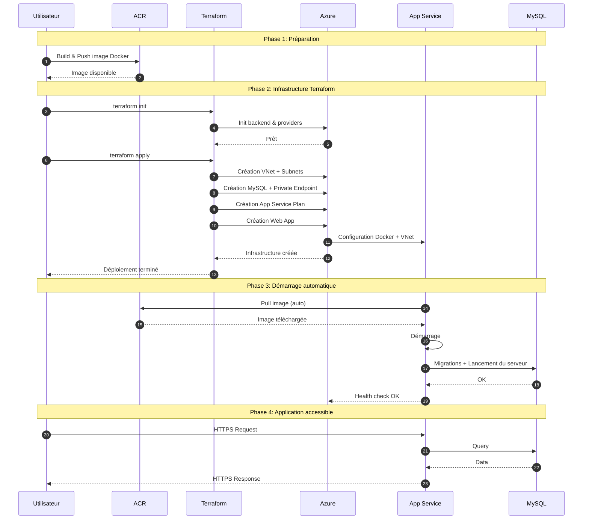

# Schéma de déploiement PaaS

Ce document explique le workflow complet du déploiement PaaS, étape par étape.

## Diagramme de séquence du déploiement

Le diagramme suivant illustre les interactions entre les différents composants lors du déploiement PaaS :



## Détail des étapes

### Étape 1 : Préparation

**Actions effectuées :**
1. Build de l'image Docker depuis `source/sample-app-master/`
2. Push de l'image vers Azure Container Registry (ACR)
3. Configuration des variables Terraform dans `terraform.tfvars`

**Script utilisé :**
```bash
source/build-docker-image-paas.sh
```

**Résultat :**
- Image Docker disponible dans ACR : `image-paas:latest`
- Variables configurées

### Étape 2 : Terraform Init

**Commande :**
```bash
terraform init -reconfigure
```

**Actions effectuées :**
- Initialise le backend Azure Storage pour stocker l'état Terraform
- Télécharge les providers nécessaires (azurerm)
- Configure les modules locaux

**Résultat :**
- Terraform prêt à appliquer la configuration
- État Terraform synchronisé avec le backend

### Étape 3 : Terraform Apply

**Commande :**
```bash
terraform apply -var-file="terraform.tfvars" -auto-approve
```

**Ressources créées (dans l'ordre) :**

1. **Bootstrap** (`terraform/bootstrap/`)
   - Vérification/création du Resource Group
   - Vérification du Storage Account pour le backend
   - Vérification de l'Azure Container Registry (ACR)

2. **Network** (`terraform/network/`)
   - Création du Virtual Network (VNet)
   - Création du sous-réseau pour l'App Service (`app_subnet`)
   - Création du sous-réseau pour la base de données (`mysql_subnet`)
   - Configuration des adresses IP et des délégations

3. **Database** (`terraform/db/`)
   - Création de la base de données Azure Database for MySQL Flexible Server
   - Configuration du réseau privé (Private Endpoint)
   - Configuration des règles de pare-feu
   - Création de la base de données et de l'utilisateur administrateur
   - Configuration de la haute disponibilité

4. **App Service** (`terraform/app/`)
   - Création du plan App Service (App Service Plan)
     - Niveau : B1 (Basic)
     - OS : Linux
   - Création de l'application web Linux (Linux Web App)
     - Configuration Docker (image depuis ACR)
     - Configuration des variables d'environnement
     - Configuration de l'identité managée
     - Intégration au réseau virtuel (VNet Integration)
     - Configuration HTTPS uniquement

5. **Intégration réseau**
   - Connexion de l'App Service au sous-réseau
   - Configuration du Private Endpoint pour la base de données
   - Règles de routage réseau

**Résultat :**
- Infrastructure Azure complète créée
- App Service configuré et prêt à démarrer
- Base de données accessible via réseau privé uniquement

### Étape 4 : App Service Configuration (automatique)

**Actions effectuées automatiquement par Azure :**

1. **Pull de l'image Docker**
   - L'App Service se connecte à ACR
   - Récupère l'image `image-paas:latest`
   - Authentification via identifiants ACR ou Managed Identity

2. **Configuration des variables d'environnement**
   - Variables injectées depuis la configuration Terraform :
     - `WEBSITES_PORT` : Port exposé par le conteneur (80)
     - `DOCKER_ENABLE_CI` : Active le Continuous Integration
     - `APP_DEBUG` : Mode debug (false)
     - `APP_ENV` : Environnement (production)
     - `APP_KEY` : Clé d'application Laravel
     - `DB_CONNECTION` : Type de connexion (mysql)
     - `DB_HOST` : Adresse FQDN de la base de données
     - `DB_PORT` : Port de la base de données (3306)
     - `DB_DATABASE` : Nom de la base de données
     - `DB_USERNAME` : Identifiant de connexion
     - `DB_PASSWORD` : Mot de passe de connexion

3. **Démarrage du conteneur**
   - Azure démarre le conteneur Docker
   - Exécute le script d'entrée (`entrypoint.sh`)
   - Application Laravel démarre

4. **Health checks**
   - Azure vérifie que l'application répond
   - Monitoring automatique activé

**Résultat :**
- Application Laravel démarrée et fonctionnelle
- Application accessible via HTTPS sur l'URL App Service

### Étape 5 : Application déployée

**Vérifications :**
- Application accessible sur `https://<nom-app-service>.azurewebsites.net`
- Base de données connectée via réseau privé
- Conteneur Docker en cours d'exécution
- Logs disponibles dans Azure Portal

## Ordre d'exécution détaillé

1. **Terraform Bootstrap** → Vérifie le Resource Group et ACR
2. **Terraform Network** → Crée le VNet avec 2 sous-réseaux
3. **Terraform Database** → Crée MySQL Flexible Server avec Private Endpoint
4. **Terraform App Service Plan** → Crée le plan de service
5. **Terraform Linux Web App** → Crée l'application web
6. **Azure (automatique)** → Pull l'image Docker depuis ACR
7. **Azure (automatique)** → Configure les variables d'environnement
8. **Azure (automatique)** → Démarre le conteneur Docker
9. **Azure (automatique)** → Health checks et monitoring

## Configuration réseau PaaS

### Architecture réseau

```
VNet (10.0.0.0/16)
    │
    ├─► App Subnet (10.0.2.0/24)
    │       │
    │       └─► App Service (VNet Integration)
    │
    └─► MySQL Subnet (10.0.1.0/24)
            │
            └─► MySQL Flexible Server
                    │
                    └─► Private Endpoint
```

### Sécurité réseau

- **App Service** : Accessible uniquement via HTTPS (port 443)
- **MySQL** : Accessible uniquement via réseau privé (Private Endpoint)
- **Communication App → DB** : Via réseau privé uniquement (pas d'exposition publique)
- **VNet Integration** : App Service intégré au réseau virtuel

## Variables d'environnement App Service

Les variables suivantes sont configurées automatiquement par Terraform :

```hcl
app_settings = {
  WEBSITES_PORT               = "80"
  DOCKER_ENABLE_CI            = "true"
  APP_DEBUG                   = "false"
  APP_ENV                     = "production"
  APP_KEY                     = "base64:..."
  DB_CONNECTION               = "mysql"
  DB_HOST                     = "<db_fqdn>"
  DB_PORT                     = "3306"
  DB_DATABASE                 = "<db_name>"
  DB_USERNAME                 = "<db_username>"
  DB_PASSWORD                 = "<db_password>"
}
```

## Durée estimée

- **Build & Push Docker** : 2-5 minutes
- **Terraform Apply** : 8-15 minutes
- **App Service Startup** : 2-5 minutes (automatique)
- **Total** : ~12-25 minutes

## Points d'attention

1. **Image Docker** : Doit être poussée dans ACR avant le déploiement
2. **Variables** : Toutes les variables doivent être correctement configurées
3. **Réseau** : L'App Service doit pouvoir accéder à ACR et à la base de données
4. **Private Endpoint** : La base de données n'est accessible que via réseau privé
5. **VNet Integration** : L'App Service doit être intégré au VNet pour accéder à la DB
6. **ACR Access** : L'App Service doit avoir les permissions pour pull l'image

## Différences avec IaaS

| Aspect | IaaS | PaaS |
|--------|------|------|
| **Configuration VM** | Ansible requis | Automatique (Azure) |
| **Démarrage app** | Docker Compose manuel | Automatique (Azure) |
| **Réseau** | 1 sous-réseau | 2 sous-réseaux (App + DB) |
| **Sécurité** | NSG + iptables | Private Endpoint + VNet Integration |
| **Monitoring** | À configurer | Intégré (Azure Portal) |
| **Scaling** | Manuel | Automatique (selon plan) |

## Dépannage

Si une étape échoue :
1. Vérifiez les logs dans Azure Portal (App Service → Log stream)
2. Vérifiez que l'image Docker est bien dans ACR
3. Vérifiez les variables d'environnement dans App Service
4. Vérifiez la connectivité réseau (VNet Integration)
5. Consultez la section Dépannage du tutoriel

